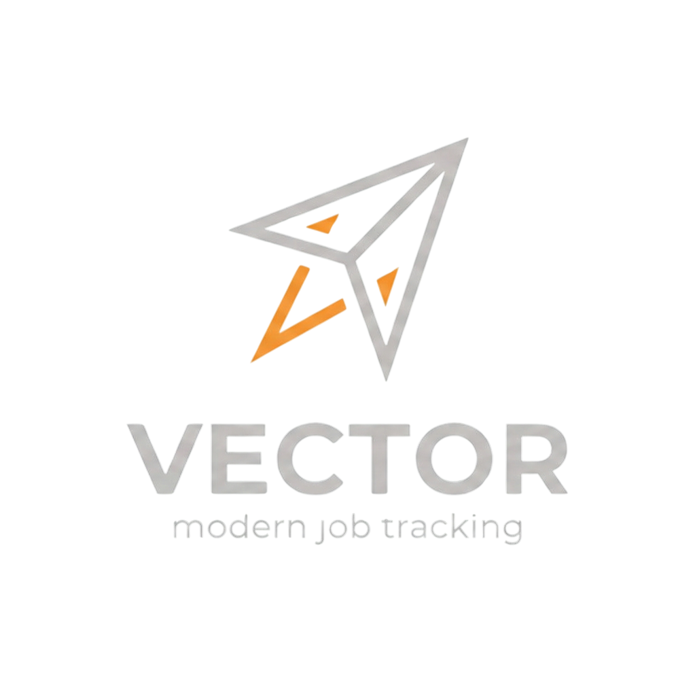

# Vector ✈️

<div align="center">



**Modern Job Application Tracking System**

[](https://nextjs.org/)
[](https://www.typescriptlang.org/)
[](https://tailwindcss.com/)

[Demo](#demo) • [Features](#features) • [Installation](#installation) • [Tech Stack](#tech-stack)

</div>

---

## 🎯 Overview

Vector is a sleek, modern job application tracking system built with Next.js 16. Track your job search journey with an intuitive Kanban board, calendar integration, and beautiful analytics — all wrapped in a stunning glassmorphism UI with animated backgrounds.

## ✨ Features

### 📋 **Kanban Board**
- Drag-and-drop job cards between status columns
- Status tracking: Wishlist → Applied → OA Received → Interview → Offer/Rejected
- Priority levels (High, Medium, Low)
- Quick status changes via drop zones

### 📊 **Analytics Dashboard**
- Visual breakdown of your application pipeline
- Interview and offer rate tracking
- Status distribution charts
- Performance tips

### 📅 **Calendar**
- Schedule interviews, OAs, and follow-ups
- Event types with color coding
- Upcoming events sidebar
- Mark events as complete

### 🎨 **Modern UI/UX**
- Glassmorphism design with animated glitch background
- Dark mode optimized
- Responsive layout
- 100+ company logos with automatic favicon fetching
- Premium glass card effects

### 💾 **Local Storage**
- All data persisted locally via Zustand
- No account required
- Export/import functionality
- Privacy-first approach

## 🖼️ Screenshots

<div align="center">

| Dashboard | Edit Modal |
|:---------:|:----------:|
| Kanban board with glass cards | Job details with company logo |

</div>

## 🚀 Installation

### Prerequisites
- Node.js 18+
- npm or yarn

### Quick Start

```bash
# Clone the repository
git clone https://github.com/macayu17/Vector.git

# Navigate to project directory
cd Vector

# Install dependencies
npm install

# Start development server
npm run dev
```

Open [http://localhost:3000](http://localhost:3000) to view the app.

### Build for Production

```bash
npm run build
npm start
```

## 🛠️ Tech Stack

| Technology | Purpose |
|------------|---------|
| **Next.js 16** | React framework with App Router |
| **TypeScript** | Type safety |
| **Tailwind CSS 4** | Utility-first styling |
| **Zustand** | State management |
| **Radix UI** | Accessible components |
| **shadcn/ui** | UI component library |
| **dnd-kit** | Drag and drop |
| **Lucide React** | Icons |
| **Zod** | Schema validation |

## 📁 Project Structure

```
src/
├── app/                    # Next.js App Router pages
│   ├── dashboard/          # Main Kanban board
│   ├── analytics/          # Statistics & charts
│   ├── calendar/           # Event scheduling
│   ├── archive/            # Rejected/stalled applications
│   └── settings/           # User preferences
├── components/
│   ├── backgrounds/        # Animated glitch background
│   ├── kanban/             # Board, cards, modals
│   ├── layout/             # Sidebar, TopBar
│   └── ui/                 # shadcn components
├── constants/              # Company domain mappings
├── lib/                    # Utilities, schemas, mock data
├── store/                  # Zustand stores
└── types/                  # TypeScript definitions
```

## 🎨 Design System

### Glass Effect
The UI uses a carefully crafted glassmorphism effect:
- Semi-transparent dark backgrounds
- Subtle white border highlights
- Inset shadow for glass edge effect
- Large blur shadows for depth

### Color Palette
- **Primary**: Purple (#7c3aed)
- **Background**: Animated letter glitch effect
- **Cards**: Dark glass with 60-70% opacity
- **Accents**: Blue, Green, Amber, Red for statuses

## 🔧 Configuration

### Adding Companies
Edit `src/constants/companies.ts` to add company domain mappings for logo fetching:

```typescript
export const COMPANY_DOMAINS: Record<string, string> = {
  "google": "google.com",
  "notion": "notion.so",
  // Add more...
};
```

### Customizing Statuses
Modify `src/types/index.ts` to customize application statuses:

```typescript
export const APPLICATION_STATUSES = [
  'WISHLIST',
  'APPLIED',
  'OA_RECEIVED',
  // Add custom statuses...
] as const;
```

## 📝 License

This project is open source and available under the [MIT License](LICENSE).

## 🙏 Acknowledgments

- [shadcn/ui](https://ui.shadcn.com/) for the beautiful component library
- [Radix UI](https://www.radix-ui.com/) for accessible primitives
- [dnd-kit](https://dndkit.com/) for smooth drag and drop

---

<div align="center">

**Built with ❤️ for job seekers everywhere**

[⬆ Back to top](#vector-️)

</div>
